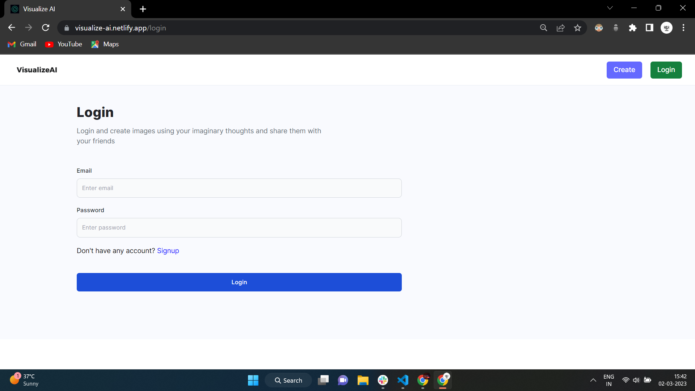
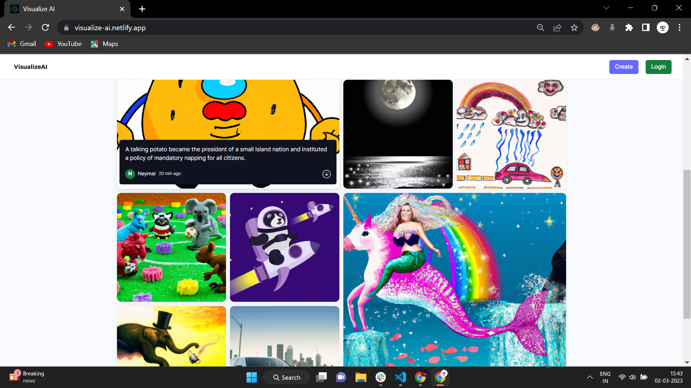
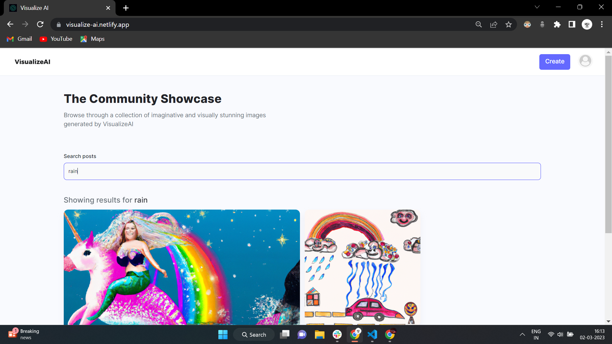
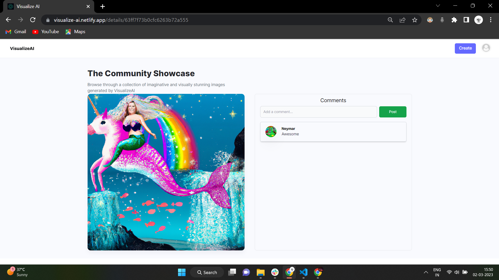
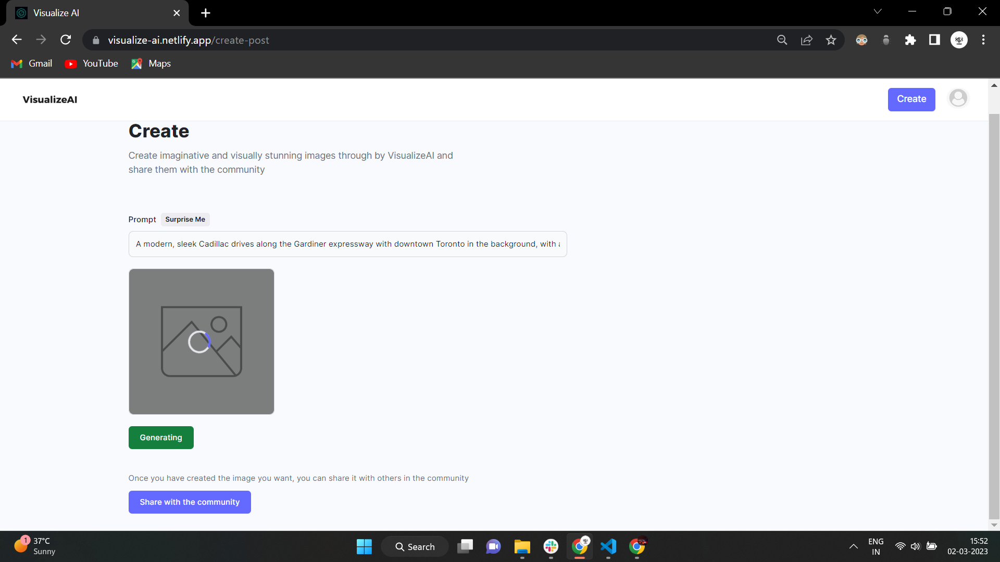
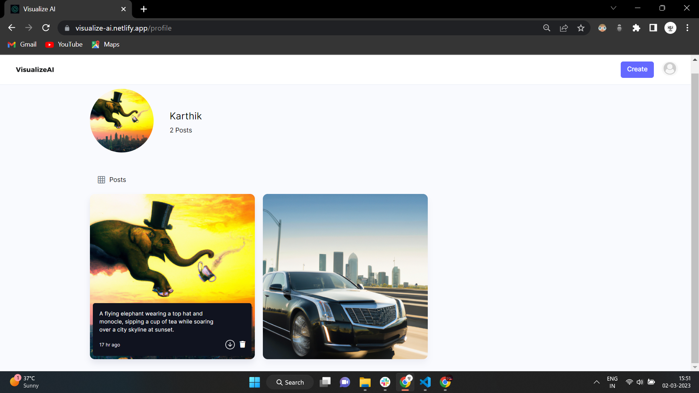

<a href="https://github.com/aljithkj02/VisualizeAI-CLIENT">Frontend Github</a>
 
 

# VisualizeAI

VisualizeAI is a web application that allows users to generate images based on their imagination or unrealistic thoughts, with the help of OpenAI. The application is built using the MERN stack (MongoDB, Express, React, Node.js) and provides a platform for users to share their generated images with the community.

## Features

<ul>
    <li>User registration and login</li>
    <li>Image generation based on user input, with the help of OpenAI</li>
    <li>Image sharing with the community</li>
    <li>User profile with all the generated images</li>
    <li>Post deletion</li>
    <li>Commenting on other users' posts</li>
    <li>Search functionality for posts</li>
</ul>
 

## Usage
### To use visualizeUI, follow these steps:

 
<ol>
    <li>Sign up for an account on VisualizeUI by clicking on the "Login" button on the homepage.</li>
    
 
 
    <li>After completing the registration and login process, you will be directed to the main page where you can view a collection of images shared by other users. These images will be available for download, providing you with the option to save them to your device.</li>
    
 
 
    <li>If you want to search for specific posts, you can use the search bar located on the homepage. Enter your search query to view the matching results.</li>
    
 
 
    <li>When you click on a specific post, you will be directed to the post details page where you can view the prompt used to generate the image. Additionally, you can leave a comment on the post.</li>
    
 
 
    <li>When you click the "Create" button in the navigation bar, you will be directed to the image generation page where you can start creating your own images. By entering your desired input in the designated text field and clicking the "Generate" button, you can create your first image. Once generated, you can share your image with the community.</li>
    
 
 
    <li>By clicking on the profile icon in the navbar and selecting "Profile", you will be directed to your profile page. Here, you can view the total number of posts you have created, as well as the specific posts that you have generated. If desired, you also have the option to delete any of your posts.</li>
    
 
 
    <li>To log out of your account, simply click on the profile icon in the navigation bar and select "Logout". This will prompt you to sign out of your account, completing the logout process.</li>
</ol>

